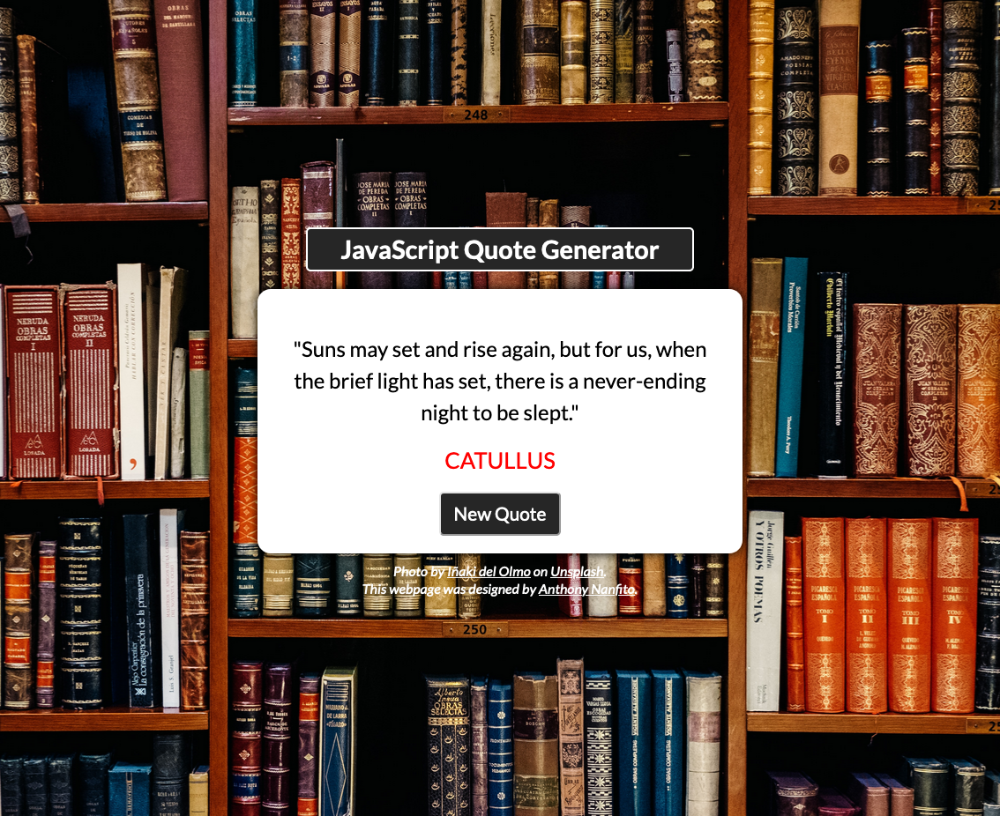

# Random Quote Generator

## Contents
- [About](#about)
- [Status](#status)
- [Connect](#connect)

## About
A simple random quote generator using HTML, CSS, and JavaScript. This project was built as part of the [JavaScript DOM Manipulation – Full Course for Beginners](https://youtu.be/5fb2aPlgoys) taught by CodeLab and hosted by freeCodeCamp. This project was created as part of my participation in the [#100DaysOfCode Challenge](https://github.com/ananfito/100-days-of-code).

## Status

This page is a complete, but I continue to make periodic updates to it as I learn more about web development and improve my skills. A live version of this project can be viewed at https://ananfito.github.io/random-quote-generator/.

## Connect

- [Twitter](https://twitter.com/wordsbyfifi)
- [LinkedIn](https://linkedin.com/in/anthonynanfito)
- [Portfolio](https://ananfito.github.io)
- [Blog](https://ananfito.hashnode.dev)
